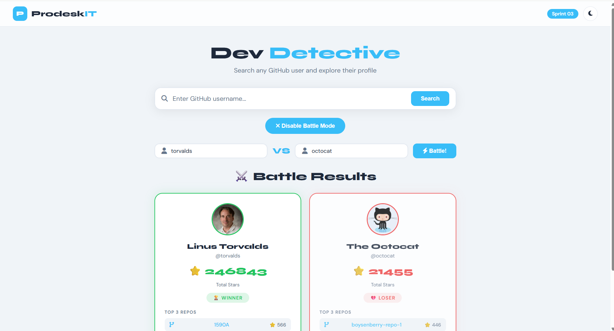

# Dev Detective — GitHub Search Client
**Sprint 03 | Software Engineer Trainee | Piyush Seth**

---

## Live Demo

https://prodesk-sprint03.vercel.app

## Screenshot

## GitHub

https://github.com/piyushseth1357

---

## Sprint Deliverables

### ✅ Phase 1 — Base MVP (Mandatory)
- ✅ Search input — GitHub username search
- ✅ Profile Card — Avatar, Name, Bio, Join Date, Portfolio URL
- ✅ Async/Await — fetch() with async logic
- ✅ Loading State — spinner while fetching
- ✅ Error State — "User Not Found" on 404
- ✅ App does not crash on error

### ✅ Phase 2 — Data Expansion
- ✅ Repos fetch — second API call using repos_url
- ✅ Top 5 Latest Repositories rendered
- ✅ Repo names are clickable links (open in new tab)
- ✅ Date formatting — ISO to "25 Jan 2023" format
- ✅ Stars and Forks count shown per repo

### ✅ Phase 3 — Battle Mode
- ✅ Battle Mode toggle button
- ✅ Dual input UI for two usernames
- ✅ Promise.all() — both users fetched simultaneously
- ✅ Total Stars calculated using reduce()
- ✅ Winner card — green indicator 🏆
- ✅ Loser card — red indicator 💔
- ✅ Top 3 repos shown in battle cards

---

## Tech Stack
- HTML5 — Page structure
- CSS3 — Styling, Dark mode, Responsive
- Vanilla JavaScript — Async/Await, Fetch API
- GitHub REST API — User and Repo data
- Promise.all() — Parallel API calls

---

## API Endpoints Used
- User Info → https://api.github.com/users/{username}
- User Repos → https://api.github.com/users/{username}/repos

---

## File Structure
- index.html — Page structure
- style.css — All styling
- app.js — Complete JS logic
- Prompts.md — AI usage log
- README.md — Documentation

---

## Developer
**Name:** Piyush Seth
**Role:** Software Engineer Trainee
**Company:** Prodesk IT
**GitHub:** https://github.com/piyushseth1357
**Live Site:** https://prodesk-sprint03.vercel.app